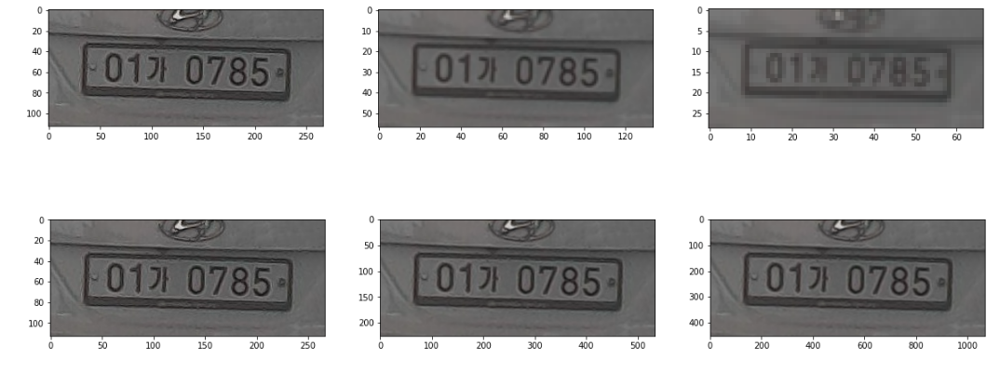
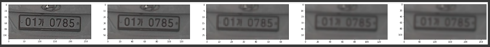
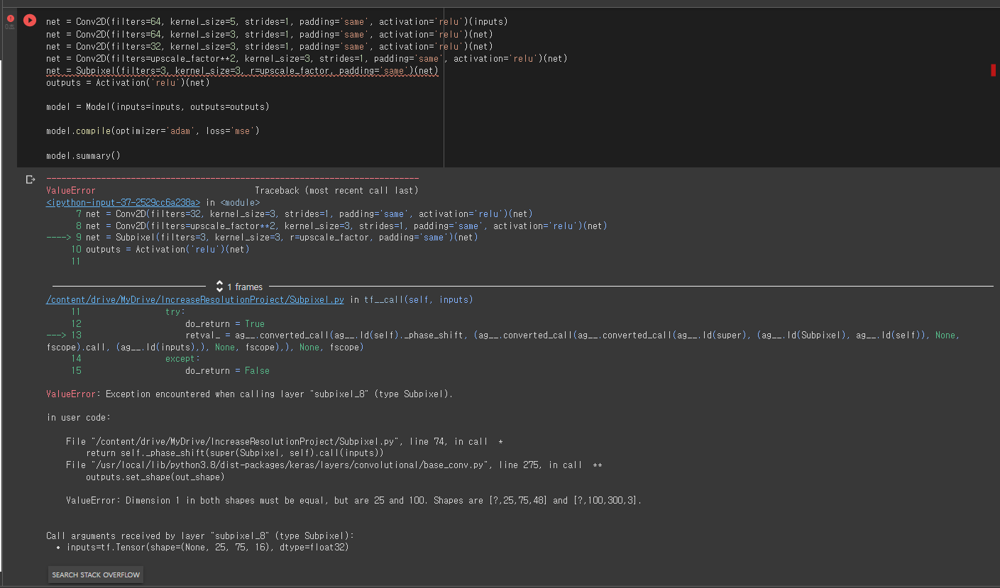

# 🧐Increase-Resolution-project
주제 : 컴퓨터 비전, 딥러닝 기술을 이용해 저해상도 블랙박스 이미지의 화질을 개선한다.         
주제 선정 이유 : 부모님의 주차된 차량을 누군가 긁고 도망갔다! 이 범인을 잡기 위해 블랙박스를 확인했는데 생각보다 화질이 너무 좋지 못해서 번호판을 읽기가 쉽지가 않았다. 그래서 이런 저화질 이미지를 고화질로 바꾸는 방법이 없을까 고민하다 이 프로젝트를 시작하게 되었다.       
사용한 도구 : Colab, Python, OpenCV, AIhub번호판데이터         
핵심폴더 : 루트 디렉토리에서 

***
## 1. OpenCV의 다운스케일링, 업스케일링 함수 사용해보기(가우시안 피라미드)

### 1) cv2.pyrDown()

큰 이미지를 작은 이미지로 다운샘플링하는 작업이다. 이때 큰 이미지를 작은 이미지로 축소하게 되면 그만큼 픽셀 수가 줄어들어야 한다. 그럼 기본적으로 조밀하게 구성되어 있던 픽셀들을 없에야 한다. 이때 아무렇게나 픽셀을 날려버리면 이미지를 축소하는 것이 아니라 그냥 이미지를 자르는 것과 다를 것이 없어진다. 그러므로 2 step으로 매끄럽게 축소한다.           

1. 가우시안 필터로 blur 처리하기(그냥 원본 이미지에서 2번째 스탭을 실행하면 aliasing이 심하기 때문에 해주는 작업이다)

2. 짝수번째 행과 짝수번째 열 픽셀들을 없에기(이미지가 가로 1/2, 세로 1/2로 줄어 면적으로 비교하면 1/4로 축소될 것이다.)

### 2) cv2.pyrUp()

작은 이미지를 큰 이미지로 업샘플링하는 작업이다. 위에서 설명한 pyrDown()과 반대로 투박하게 구성되어 있던 픽섹들을 조밀하게 표현해야 한다. 그러면 원래 있던 픽섿들 사이사이에 추가적으로 픽셀이 들어가야 할 것이다. 이 경우도 2 step으로 확대한다. 하지만 이 경우 순서는 반대로 해야 할 것이다.           

1. 픽셀들을 추가해줘 이미지를 키운다. 예를 들어 1,3 이었으면 1,1,3,3 이런식으로 늘리는 것이다.(이미지가 가로 2배, 세로 2배로 커져 면적으로 비교하면 4배로 확대될 것이다.)

2. 가우시안 필터로 blur 처리하기(커진 이미지를 좀 더 자연스럽게 하기 위한 작업)

**pyrDown과 pyrUp 실행한 결과**

**그럼 다운샘플링으로 이미지를 줄였다가 다시 업샘플링으로 이미지를 확대하면 원본으로 돌아오는 것인가?**

위 결과를 보면 "원본src -> downsampling 한번 -> downsampling 두번 -> upsampling 한번 -> upsampling 두번"한 결과를 확인할 수 있다. 하지만 첫번째 원본src 이미지와 마지막 upsampling2 이미지는 너무나도 다르다. 왜 그럴까?         

그 이유는 여기서 사용한 다운샘플링에서는 짝수번째 행과 짝수번째 열들의 픽셀을 그냥 삭제하고 마지막으로 가우시안 필터를 이용해 blur처리했다. 그러면 이때 삭제된 짝수번째 행과 짝수번째 열들의 픽셀들을 업샘플링 과정에서 다시 유추해야 원본 화질일 복원된다. 하지만 가우시안 피라미드 방법의 업샘플링은 그냥 이미지를 두배로 단순하게 키우고 blur 처리하는 방식이다. 이렇게 업샘플링 과정에서 지워졌던 픽셀들을 유추하기 위해서는 다른 방식이 필요하다.

***
## 2. Subpixel Convolution 논문 활용해보기
[참고한 자료]    
https://www.youtube.com/watch?v=VxRCku4Bkgg (영상)       
https://github.com/kairess/super_resolution (소스코드)     
https://arxiv.org/abs/1609.07009 (논문)    

- 발생한 오류!

같은 코드를 작성했는데 문제가 발생함. 아마 라이브러리 버전 차이일 것으로 추정.
해결되면 이어서 작성해야 하는데, 아직 해결 못하는 중ㅠㅠ

## 3. SRCNN 활용해보기
SRCNN(Super Resolution Convolutional Neural Network)이란 CNN을 사용해 저해상도 이미지를 고해상도로 업스케일링하는 알고리즘을 의미한다.
